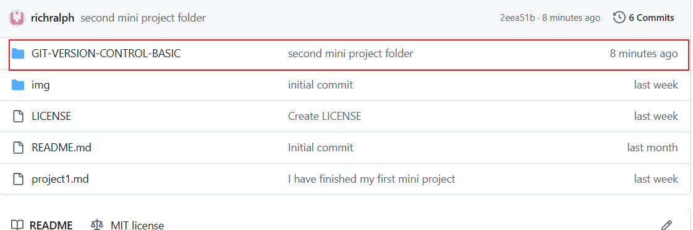
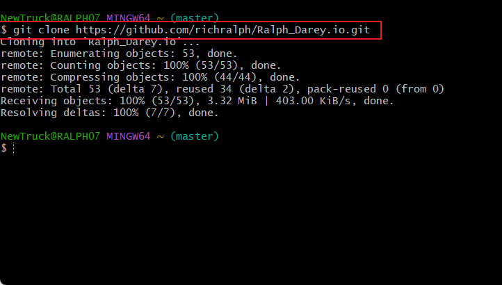
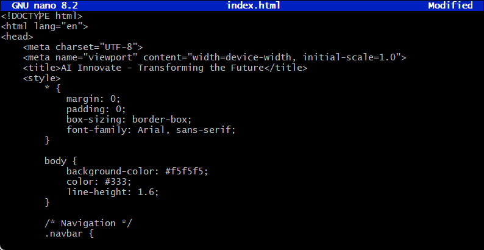

# Hands-On Git Collaboration: Version Control System in Action

## Project Overview

This project demonstrates the practical use of a Version Control System (VCS) in a collaborative software development environment using Git and GitHub. It simulates a team scenario where multiple contributors work on different sections of a web project while preserving each other’s work, resolving conflicts, and managing pull requests.

## 👥 Team Roles

👤 **Raphael** Project Owner & Developer
👨‍💻 **Seuntrial:** Collaborator Developer (Feature Contributor)
👀 **Jirosecurities:** Reviewer (Code Reviewer)

# Project Setup
- Raphael create a repository

- Clone repository locally

- Add index.html file

- Stage, Commit and Push changes:

git add .

git commit -m "Added initial commit of the AI Website"

git push

# ✅ Step 2: Add Collaborators

- Add a collaborator from settings

