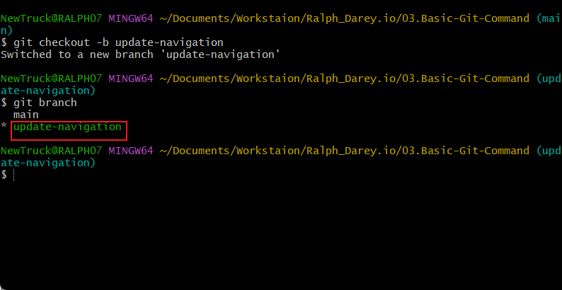

# Basic Git Command Project

## 1. Install Git

Visit the [official Git website](https://git-scm.com/) and [download](https://git-scm.com/downloads/win) the version of Git for your operating system.


## 2. Create a GitHub Repository

- Sign up or log in to [GitHub](https://github.com/).


- Click the "+" icon in the top-right corner and select **"New repository"**.


- Name your repository (e.g., 03.Mini Project-Basic-Git-Commands) and initialize it with a README file.

- Click "Create repository".


## 3. Clone the Repository

- On your repository page on GitHub, click the "Code" button and copy the HTTPS URL.


- Open your terminal or command prompt.

- Create a folder named DevOps-Projects in your desired directory (e.g., Documents/Workspace/DevOps-Projects) and navigate to it:
```bash
mkdir ~/Documents/Workspace/Ralph_Darey.io

cd ~/Documents/Workspace/Ralph_Darey.io
```


- Clone (download) the repository using:

```bash
git clone https://github.com/richralph/Ralph_Darey.io.git
```
- Since you just clonned your repository your branch is **'Main'.**

- Navigate to the repository you clonned

```bash 
cd /Documents/Workstaion/Ralph_Darey.io/03.Basic-Git-Command
```


- Create a file named index.html and add the content below:

```bash
touch index.html
echo "This is the Admin creating an index.html file for Tom and Jerry." >> index.html
```


- Check that changes haven't been staged:

```bash 
git status
```

- Stage the changes:

```bash
git add index.html
```

- Confirm staging:

```bash
git status
```

✅ The file name will appear in green, indicating it is staged.

- Commit the changes:
 ```bash
 git commit -m "This is my first commit"
 ```

 - Push the main branch to GitHub:
 ```bash
 git push origin main
 ```

 # This sends commits from your main branch on your laptop to GitHub (Remote Repository).

 ## 👥 Part 2: Simulating Tom and Jerry's Work

 #### We'll simulate both Tom and Jerry working on the same machine by using branches.

# 🧑 Tom’s Work

- Navigate to the project directory:

```bash
cd DevOps-Projects\03. Mini Project - Basic Git Commands
```
- Check the current branch:
```bash
git branch
```

- Create a new branch for Tom's changes:
```bash
git checkout -b update-navigation
```


- Check the branch again to see your new;y created branch.
```bash
git branch
```


- Modify index.html and add:
using the code echo command

```bash
echo "This is Tom adding Navigation to the 03,Basic-Git_Command." >> index.html
```

This simulates Tom's contribution to the project. This text represents the work he's doing on the navigation bar. In the real world, this will be an actual software code.

- Check for unstaged changes:
```bash
git status
```

- Stage the changes
```bash
git add index.html
```

- Confirm staging:
```bash
git status
```

- Commit Tom’s changes:
```bash
git commit -m "Update navigation bar"
```
- Push Tom’s branch:
```bash
git push origin update-navigation
```

# 🧑 Jerry’s Work

- Switch back to the main branch:
```bash
git checkout main
```

- Pull latest changes (e.g., Tom’s update):
```bash
git pull origin update-navigation
```

- Create a new branch for Jerry's work:
```bash
git checkout -b add-contact-info
```

- Edit index.html and add the following content:
```bash
Contact us at: contact@ai-startup.com
```

- Stage Jerry's changes:
```bash
git add index.html
```

- Commit Jerry’s changes:
```bash
git commit -m "Add contact information"
```
- Push Jerry's branch:
```bash
git push origin add-contact-info
```

# ✅ Summary

At this point:

- Tom created a branch update-navigation and added navigation details.

- Jerry created a branch add-contact-info and added contact information.

- Both contributors successfully pushed their branches to GitHub.