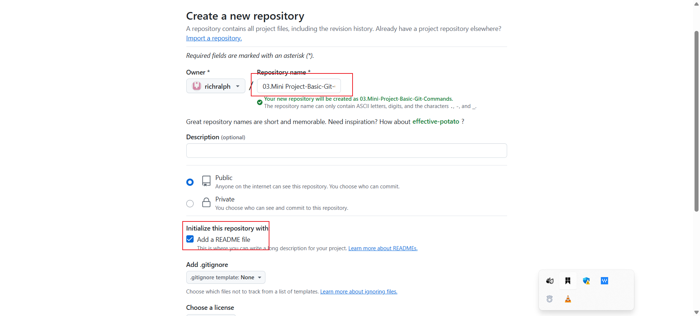

# Basic Git Command Project

## 1. Install Git

Visit the [official Git website](https://git-scm.com/) and [download](https://git-scm.com/downloads) the version of Git for your operating system.

## 2. Create a GitHub Repository

- Sign up or log in to [GitHub](https://github.com/).

- Click the "+" icon in the top-right corner and select **"New repository"**.

- Name your repository (e.g., 03.Mini Project-Basic-Git-Commands) and initialize it with a README file.

- Click "Create repository".

## 3. Clone the Repository

- On your repository page on GitHub, click the "Code" button and copy the HTTPS URL.

- Open your terminal or command prompt.

- Create a folder named DevOps-Projects in your desired directory (e.g., Documents/Workspace/DevOps-Projects) and navigate to it:

