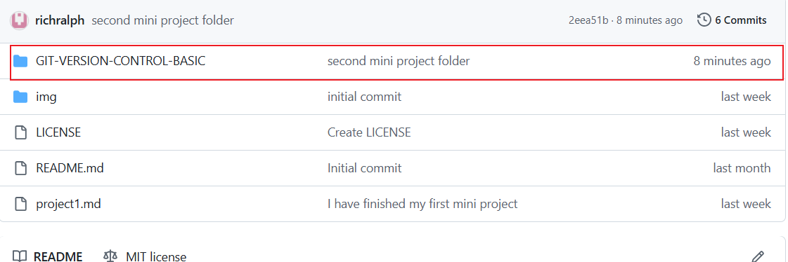
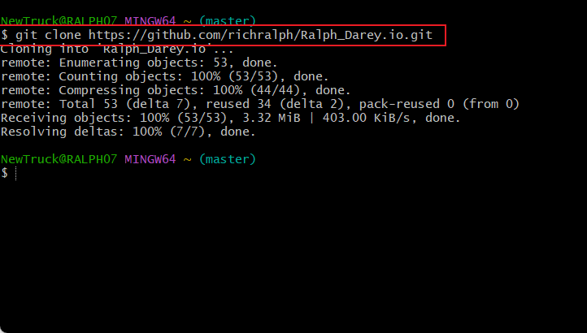
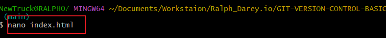
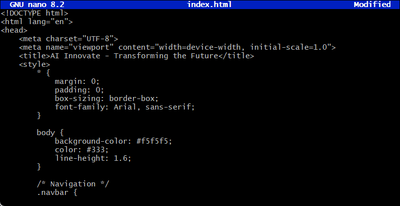
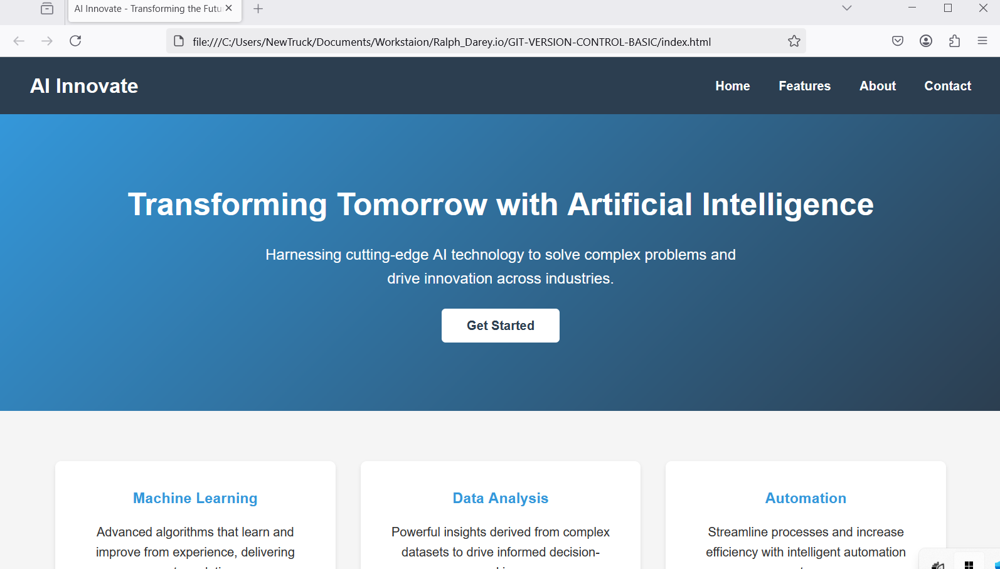

# Hands-On Git Collaboration: Version Control System in Action

## Project Overview

This project demonstrates the practical use of a Version Control System (VCS) in a collaborative software development environment using Git and GitHub. It simulates a team scenario where multiple contributors work on different sections of a web project while preserving each other’s work, resolving conflicts, and managing pull requests.

## 👥 Team Roles

👤 **Raphael** Project Owner & Developer
👨‍💻 **Seuntrial:** Collaborator Developer (Feature Contributor)
👀 **Jirosecurities:** Reviewer (Code Reviewer)

# Project Setup

- Clone repository locally

- Add index.html file

